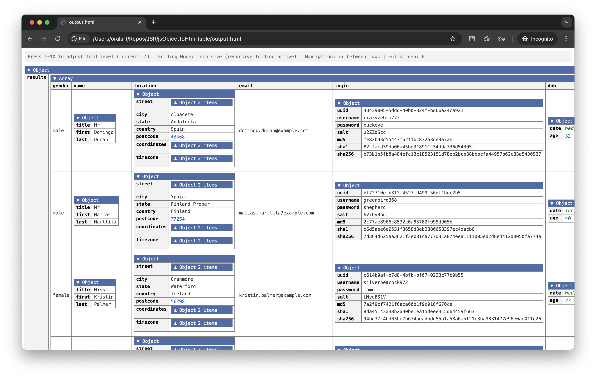

# JSON Object to HTML Viewer

A tool that converts JavaScript/JSON objects into an interactive HTML table view with a beautiful, collapsible interface. Inspired by [LinqPad](https://www.linqpad.net/)'s Dump method.

## Usage

```typescript
import  { getHtmlOfObjectTable } from "@jonpdw/json-object-to-html-viewer";


// Convert your object to HTML
const html = getHtmlOfObjectTable(yourObject);

// Write to a file
await Deno.writeTextFile("output.html", html);
```


## Example Output



